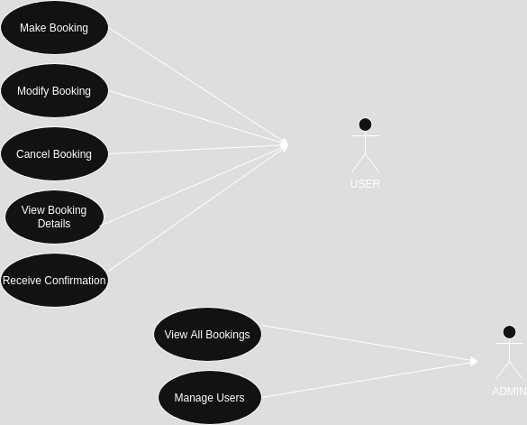

# Requirement Analysis in Software Development 

## Overview

This project helps developers master **Requirement Analysis** in the Software Development Life Cycle (SDLC) through real-world tasks. 

## What is Requirement Analysis?

**Requirement Analysis** is the process of identifying, documenting, and managing the needs and expectations of stakeholders for a software system. It involves gathering functional and non-functional requirements to ensure the final product aligns with business goals.

### Why it Matters in SDLC

In the Software Development Life Cycle (SDLC), requirement analysis is a foundational step. It helps:

- Prevent scope creep and project failure.
- Ensure developers build what users actually need.
- Provide a clear blueprint for design, development, and testing.
- Align stakeholder expectations with technical implementation.

## Why is Requirement Analysis Important?

Requirement analysis is critical in the SDLC because it:

1. **Reduces Cost and Rework**: Catching unclear or incorrect requirements early prevents expensive fixes during later stages of development.
2. **Improves Communication**: It aligns stakeholders, developers, and project managers with a shared understanding of project goals.
3. **Ensures Project Success**: Clear and validated requirements increase the likelihood of delivering a product that meets user needs and business objectives.
   
## Key Activities in Requirement Analysis

- **Requirement Gathering**  
  Collecting initial information from stakeholders, users, and business documents to identify high-level needs.

- **Requirement Elicitation**  
  Engaging with stakeholders through interviews, surveys, workshops, and observation to uncover detailed and often hidden requirements.

- **Requirement Documentation**  
  Clearly documenting all gathered requirements using standardized formats like use case diagrams, user stories, and specification documents.

- **Requirement Analysis and Modeling**  
  Organizing and structuring the requirements, identifying relationships, resolving conflicts, and creating models such as data flow diagrams (DFDs) and entity-relationship diagrams (ERDs).

- **Requirement Validation**  
  Ensuring requirements are accurate, complete, feasible, and aligned with business goals by reviewing them with stakeholders and refining as needed.

## Types of Requirements

### Functional Requirements

Functional requirements define what the system should do — the specific behaviors, functions, or features it must support.

**Examples for a Booking Management System:**
- Users must be able to create, modify, and cancel bookings.
- The system should send email confirmations after a successful booking.
- Admins should be able to view and manage all bookings.
- The system must allow filtering of bookings by date, status, and user.

### Non-functional Requirements

Non-functional requirements describe how the system performs its functions — they include performance, usability, reliability, and more.

**Examples for a Booking Management System:**
- The system should support up to 10,000 concurrent users.
- Responses to user actions must occur within 2 seconds.
- The interface must be accessible via desktop and mobile devices.
- All user data must be encrypted and follow GDPR compliance.

## Use Case Diagrams

**Use Case Diagrams** are visual representations of how users (actors) interact with a system. They show the system’s functional requirements from the user’s perspective, highlighting different use cases and relationships between them.

### Benefits of Use Case Diagrams

- Provide a clear overview of system functionality.
- Help identify all possible user interactions early in the development process.
- Serve as a communication bridge between technical teams and stakeholders.
- Aid in identifying system boundaries and actor roles.

### Use Case Diagram for the Booking System

The following diagram illustrates key actors and use cases in the booking management system:

**Actors:**
- **User** – Create, modify, or cancel bookings.
- **Admin** – Manage bookings and users.
- **System** – Sends confirmations, stores data, and enforces rules.

**Use Cases:**
- Make Booking
- Cancel Booking
- Modify Booking
- View Booking Details
- Receive Confirmation
- Manage Users (Admin)
- View All Bookings (Admin)

## Acceptance Criteria

**Acceptance Criteria** are a set of predefined conditions that a software product must meet to be accepted by stakeholders. They define the scope, boundaries, and expected behavior of a feature, serving as a checklist to confirm that the requirement has been implemented correctly.

### Why Acceptance Criteria Matter

- Ensure a shared understanding between developers, testers, and stakeholders.
- Serve as a reference for writing test cases.
- Reduce ambiguity and clarify feature behavior.
- Help prevent scope creep and feature misalignment.

### Example: Checkout Feature (Booking Management System)

**Feature**: Allow users to complete a booking through a checkout process.

**Acceptance Criteria**:
- ✅ The user must be able to review booking details before payment.
- ✅ The system must display available payment methods (e.g., credit card, PayPal).
- ✅ Payment must be processed securely using an external payment gateway.
- ✅ A confirmation message must be displayed after successful payment.
- ✅ The booking must be saved to the user’s account after checkout.
- ✅ A confirmation email must be sent to the user immediately after checkout.
